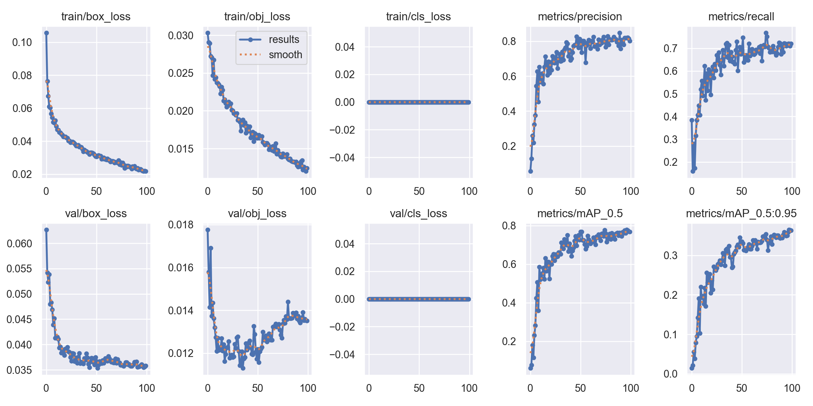
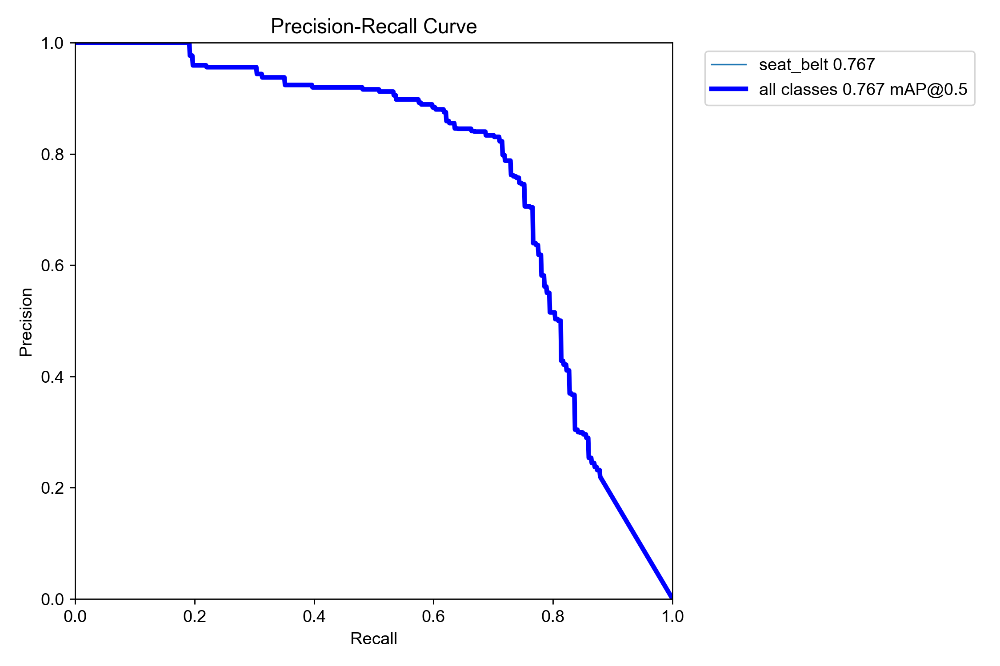
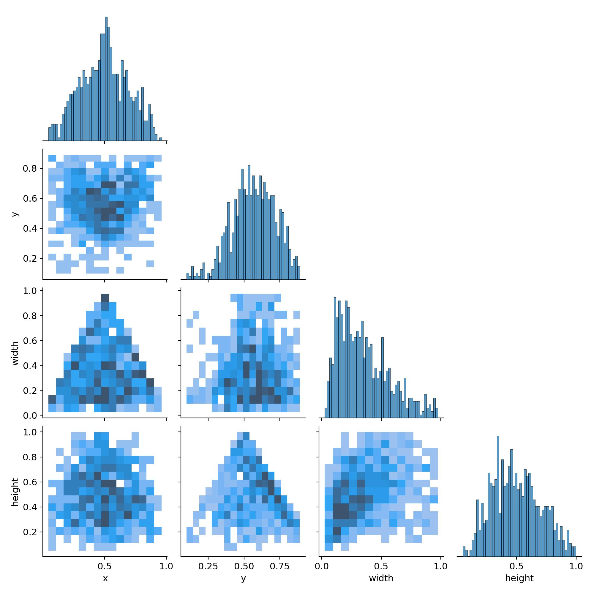
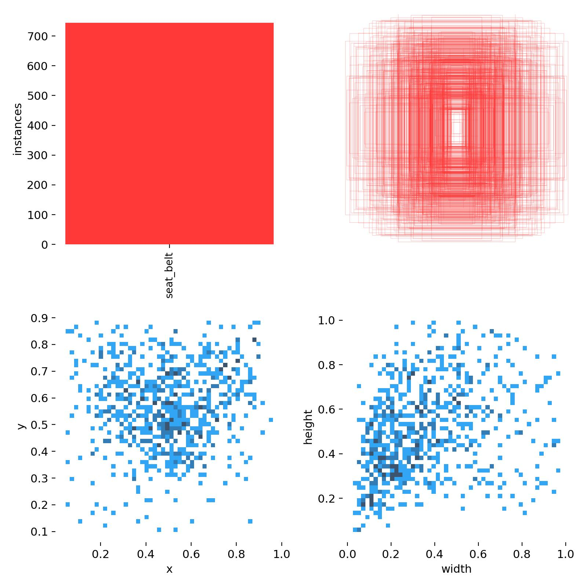
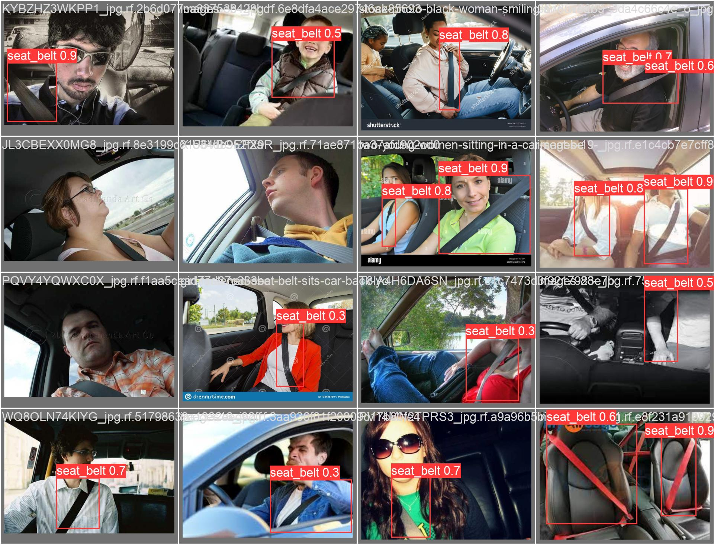
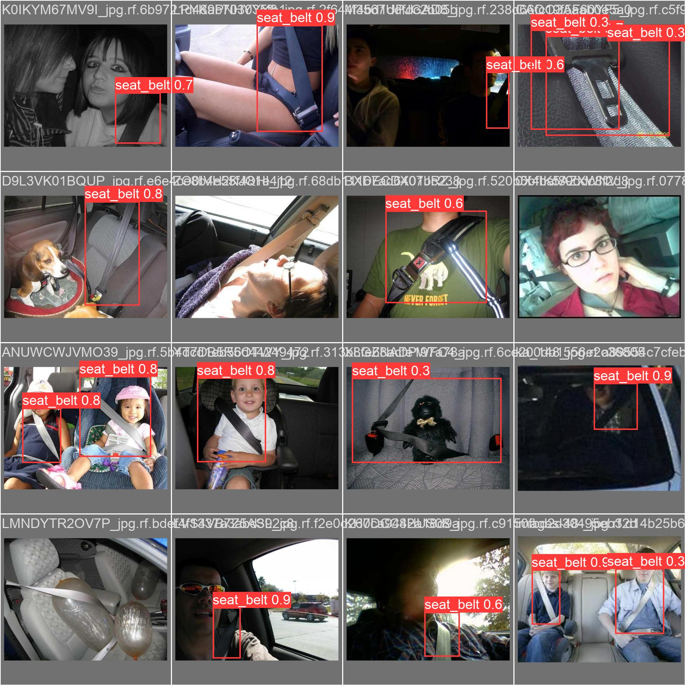

# Seatbelt Detection Model  
*Project for Nvidia AI Specialist Certification*

## 1. Opening Background Information  
Traffic accidents are one of the leading causes of death worldwide, and the lack of seatbelt usage significantly increases the severity of injuries during collisions. According to the World Health Organization (WHO), wearing seatbelts reduces the risk of death by approximately 50% in the event of an accident. Despite its importance, many drivers neglect or forget to wear seatbelts.  

As vehicle technologies evolve toward autonomy and smart functionality, there remains a pressing need to address fundamental safety measures. Developing an AI-powered system to detect seatbelt usage in real time can bridge this gap, ensuring enhanced safety for all vehicle occupants.  

---

## 2. General Description of the Current Project  
This project focuses on designing a deep learning-based model to detect seatbelt usage in real time. Using footage from in-vehicle cameras, the system analyzes whether passengers are correctly wearing seatbelts and triggers alerts when non-compliance is detected.  

### **Key Development Stages:**  
1. **Data Collection and Annotation:**  
   - Collect diverse datasets reflecting real-world conditions (e.g., variations in lighting, passenger positions, and clothing styles).  

2. **Model Design and Training:**  
   - Utilize advanced object detection and action recognition frameworks (e.g., YOLOv8, Faster R-CNN).  
   - Train the model to achieve high accuracy in detecting seatbelt usage.  

3. **System Integration:**  
   - Deploy the model in an edge-computing environment.  
   - Integrate with vehicle alert systems for real-time feedback.  

---

## 3. Proposed Idea for Enhancements to the Project  
### **Planned Improvements:**  
- **Lightweight Model Optimization:**  
   - Ensure efficient real-time performance on edge devices.  
- **Adaptive Data Augmentation:**  
   - Apply techniques to simulate various lighting conditions, clothing types, and seating arrangements.  
- **Multi-Passenger Detection:**  
   - Expand the system to detect seatbelt usage for all passengers simultaneously.  
- **Integrated Alert Mechanisms:**  
   - Enable visual, auditory, and app-based notifications through IoT integration.

---

## 4. Value and Significance of this Project  
This project addresses critical aspects of road safety and provides the following benefits:  

- **Saving Lives:**  
   - Increase seatbelt compliance to reduce fatalities and serious injuries in traffic accidents.  

- **Supporting Insurance and Legal Standards:**  
   - Offer data to insurance companies for premium adjustments and assist in accident liability assessments.  

- **Advancing Autonomous Vehicles:**  
   - Integrate with autonomous vehicle systems, enhancing passenger monitoring and overall safety.

---

## 5. Current Limitations  
### **Development Challenges:**  
- **Sensitivity to Lighting Conditions:**  
   - Accuracy drops in low light or harsh sunlight scenarios.  
- **Clothing Confusion:**  
   - Issues in distinguishing seatbelts from similarly colored or patterned clothing.  
- **Data Labeling Costs:**  
   - High costs for collecting and annotating quality datasets.  
- **Processing Constraints:**  
   - Difficulty achieving real-time performance on low-spec hardware.  

---

# Seatbelt Detection Model

This project focuses on developing a deep learning-based model to detect seatbelt usage in real time. Below is an overview of the model's performance evaluation and visual analysis.

---

## 6. Performance Analysis

### **Model Performance Evaluation**
The performance of the seatbelt detection model was evaluated using key metrics such as Precision, Recall, F1-score, and mAP (mean Average Precision). These metrics provide detailed insights into how accurately and comprehensively the model detects seatbelt usage in various scenarios.

---

### **Performance Results Visualization**

1. **Training and Validation Loss**
   - The graph below shows a consistent reduction in training and validation losses (`box_loss`, `obj_loss`, `cls_loss`) during the training process.
   - The validation loss mirrors the training loss pattern, indicating the model is not overfitting and generalizes well to unseen data.
   - Key takeaway: The decreasing trends in loss demonstrate the model's steady learning and improving predictions.

   

---

2. **Precision, Recall, and mAP Metrics**
   - **Precision:** Reflects the proportion of correct detections out of all detections, reaching a maximum of ~0.75.
   - **Recall:** Measures the model's ability to detect all actual objects, improving throughout the training process.
   - **mAP (mean Average Precision):**
     - `mAP@0.5`: Achieved 0.767, indicating high performance at IoU threshold 0.5.
     - `mAP@0.5:0.95`: Scored 0.43, showing overall robustness across different IoU thresholds.

   

---

### **Bounding Box and Label Distribution**
- **Bounding Box Correlation Matrix:**  
  The plot below analyzes relationships among bounding box attributes (`x`, `y`, `width`, `height`). It highlights clustering patterns where annotations are concentrated.
  
  

- **Label Distribution and Spatial Patterns:**  
  The label distribution graph shows the frequency of seatbelt instances across the dataset and their spatial coverage.

  

---

### **Detection Examples**
Below are examples of the model's detection results on validation data, demonstrating its performance in real-world scenarios.

1. **Batch 1 Results**  
   

2. **Batch 2 Results**  
   

---

### **Key Insights**
- **Strengths:**
  - The model demonstrates stable learning with reducing losses and strong generalization across validation data.
  - High mAP scores indicate excellent performance in detecting seatbelt instances.
  - Works well under various conditions, including different lighting and multi-passenger scenarios.

- **Limitations:**
  - The model struggles in complex backgrounds or with low-confidence detections.
  - Misclassification and false positives occur in cases with visually similar objects or poor lighting.

- **Proposed Improvements:**
  - **Data Augmentation:** Enhance the dataset with varied lighting, backgrounds, and object placements.
  - **Post-Processing:** Add advanced filtering algorithms to reduce false positives and improve classification confidence.

---

This README provides an overview of the model's performance and identifies areas for further improvement. For additional details or contributions, feel free to reach out!
